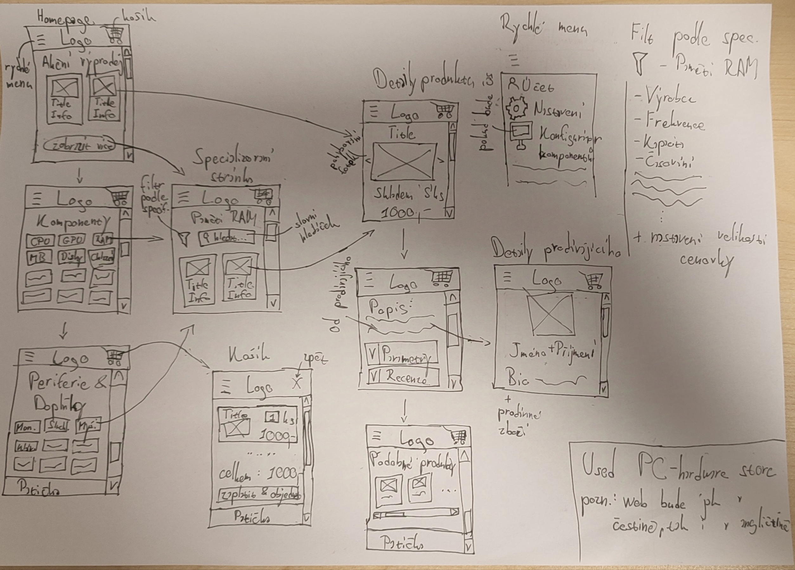

# Used PC-hardware store

*Autor: Jakub Wimmer <jakub.wimmer.s@gyarab.cz>*

## Odborný článek

Cílem projektu je vytvoření elektronické nákupní platformy specializované na prodej převážně použitých PC komponent a příslušenství. Systém obsahuje několik klíčových datových objektů:

- Produkt –> název, cena, dostupnost, výrobce, kategorie, popis, obrázek.
- Kategorie –> název, seznam produktů.
- Uživatel –> jméno, e-mail, heslo, historie objednávek.
- Košík –> produkty, celková cena, způsob platby.
- Objednávka –> uživatel, seznam produktů, cena, stav objednávky.

Uživatelské rozhraní umožňuje procházení kategorií, filtrování produktů podle specifikací (např. RAM, výrobce), přidání produktů do košíku a jejich objednání. Každý produkt má vlastní stránku s detaily, obrázky a recenzemi. Prodejci mohou přidávat produkty a spravovat objednávky. Administrace nabízí nastavení, konfiguraci a úpravu databáze produktů.

Navigace je intuitivní, s hlavním menu rozděleným na kategorie, vyhledáváním a rychlými odkazy. Wireframe ukazuje responzivní design především pro mobilní verzi. Desktopový design bude velmi podobný jen roztažený vhodně na šířku obrazovky.

## Wireframes

## DB schema

